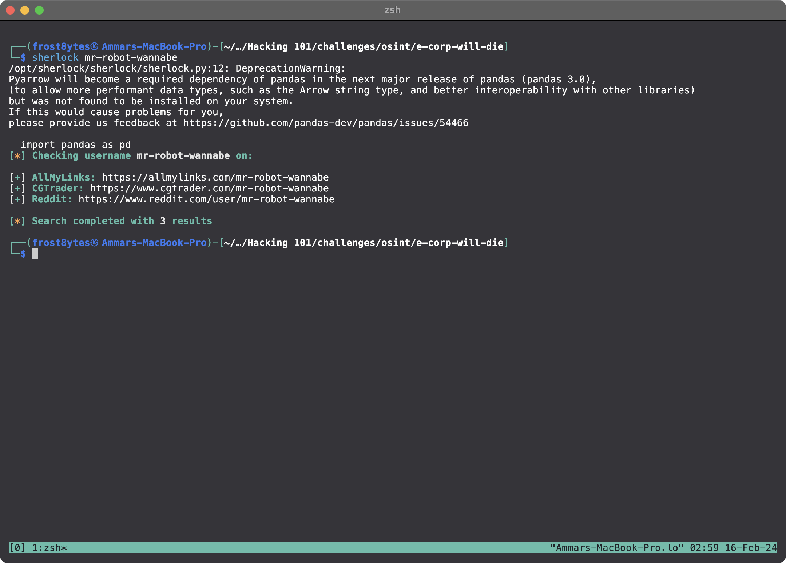
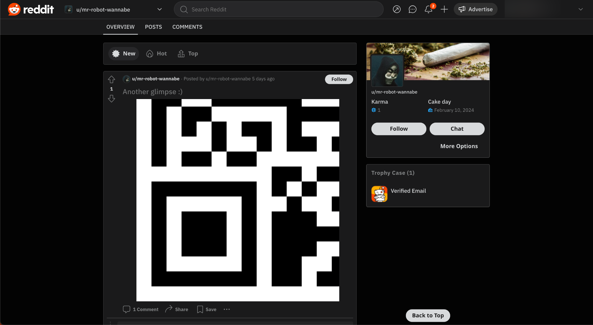
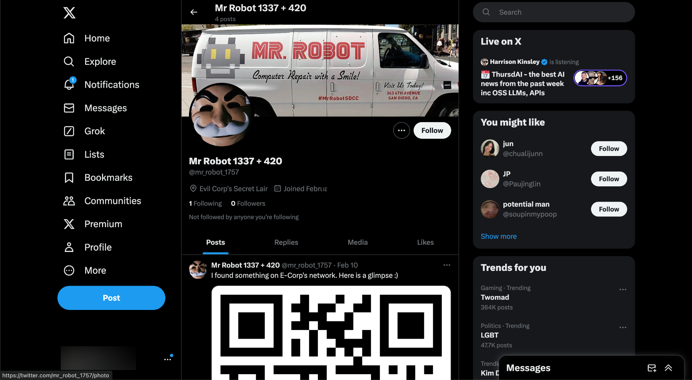
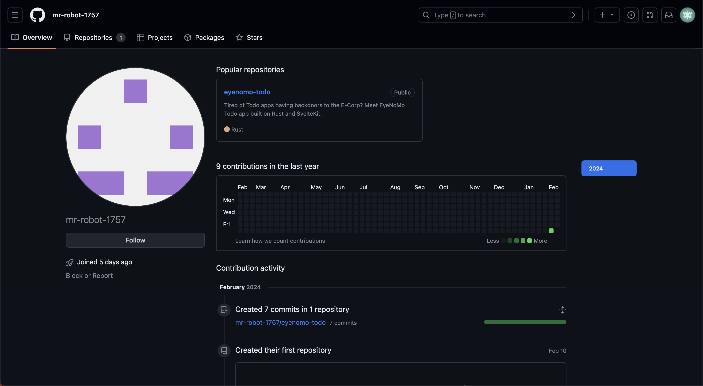

<font size="10">E-Corp will Die</font>

9<sup>th</sup> February 2024

​Prepared By: FROST8ytes

​Challenge Author(s): FROST8ytes

​Difficulty: <font color=green>Hard</font>

Flag: `Cyberhax{3z_5t41king_ski112}`

## Synopsis

- The challenge involves stalking the hacker on common social media, as well as view commit history.

## Description

Hello, fellow hacker!

I am `mr-robot-wannabe`, aka `mr_robot_1757`. I have found a way into E-Corp's network. I have yet to uncover the mystery and find a way to create havoc in the company >:)

In the meantime, I have posted a glimpse of what I think is a really important info regarding the Evil company. If you would like to help me in my journey, uncover the glimpse, then contact me :)

Flag example: `Cyberhax{3x4mp13_f14g_h3r3}`


## Skills Required

- Basic reconnaissance skills
- Basic stalking skills

## Skills Learned

- Sherlock
- Git commit history

## Challenge Overview

### Reconnaissance

Let's see what social media the hacker is on using sherlock:



By checking the links, only Reddit link seems to work. Let's visit the hacker's profile page on Reddit!



We find our first QR in the post made by the hacker. We can also see some cyphered text in the comment section.

> If you missed out on the first glimpse,
> 9EEADi^^EH:EE6C]4@>^>C0C@3@E0`fdf

The cyphered message can be decyphered using ROT47. We can do this using [Cyberchef](https://cyberchef.io/) or any other tools that you prefer.

After decyphering the message, we get a link to the hacker's Twitter account.

```
https://twitter.com/mr_robot_1757
```

By visiting the URL, we get the second QR.



In one of the tweets, we can see that the hacker complained about GitHub's restriction on usernames.

> Damn why won't GitHub let me set my username with underscores. Welp I guess I just have to live with hyphens forever.

Let's visit the hacker's GitHub profile by changing `_` to `-` in his username.

```
https://github.com/mr-robot-1757
```

We can see that the hacker has only one repository.



Let's check out the `eyenomo-todo` repository.

At first glance, there is nothing hidden in the files. So, let's check out the repository's commit history.

There is a commit named `Upload another glimpse >:)`!

By clicking on the commit, we can find the last QR!

### Putting QR Together

Let's put the QR together! Use whatever software you are comfortable with. By scanning the QR, we get the flag!

## Easter Egg

### Description
Did you catch it? Are you eyes sharp enough? ;)

Disclaimer: You need to add the curly braces to the flag.

Flag example: `Cyberhax{3x4mp13_f14g_h3r3}`

### Morse Code

Easter egg is located in `backend/.env` file. Typically .env file should be ignored by Git so that your API keys or any other sensitive information will not be pushed to GitHub.

We can decypher the morse code and get `CYBERHAX5H4RP_3Y35_G3T_R3W4RD`. Change it to the flag format and voilà!