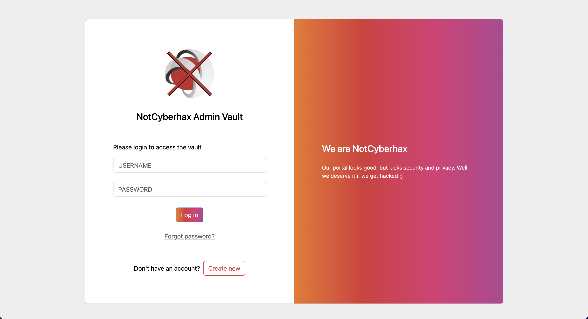
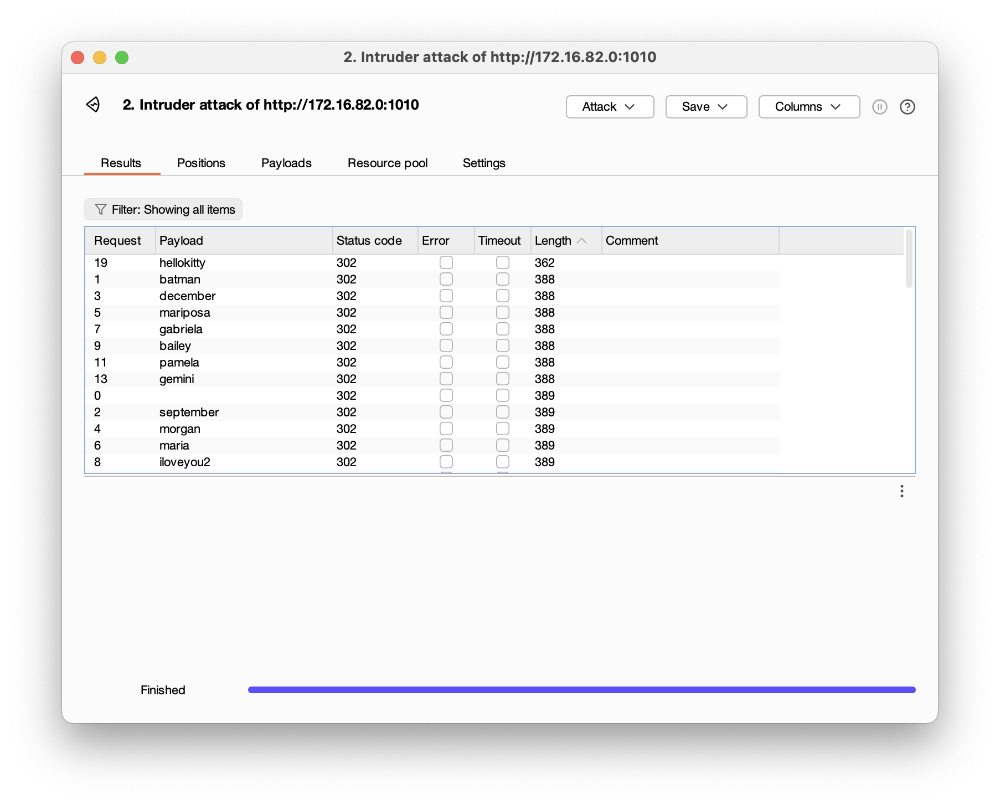

<font size="10">Forgetful Admin</font>

8<sup>th</sup> February 2024

​Prepared By: FROST8ytes

​Challenge Author(s): FROST8ytes

​Difficulty: <font color=green>Hard</font>

Flag: `Cyberhax{41w4y5_u53_g00d_p455w0rd}`

## Synopsis

The challenge involves a login page which leads to the old admin vault for NotCyberhax.

## Description

**Help!** I am _Megumi_, the IT admin for NotCyberhax.

I have an important information to retrieve quickly before the company takes down the old admin vault! I am sure my username is `admin`, but I forgot my password.

Can you help me?

Flag example: `Cyberhax{3x4mp13_f14g_h3r3}`

## Skills Required

- Basic knowledge of bruteforcing
- Basic knowledge of wordlist attack

## Skills Learned

- Bruteforce credentials with common wordlist.

## Application Overview



### Visiting the Website

We can see a login form with no weird codes when inspecting.

### Understanding Clues

Megumi states that her username is `admin`. Isn't it ironic that an IT admin never configured proper usernames? Plus isn't `admin` the default username for most portals without configuration? Perhaps this bad practice also leads to her choice for passwords.

### Bruteforcing Login

The tool used in this writeup is `Burp Suite Community Edition`.

We can capture the HTTP request when loggging in to the get following:

```http
POST /login.php HTTP/1.1
Host: <redacted>
Content-Length: 30
Cache-Control: max-age=0
Upgrade-Insecure-Requests: 1
Origin: http://172.16.82.0:1010
Content-Type: application/x-www-form-urlencoded
User-Agent: Mozilla/5.0 (Windows NT 10.0; Win64; x64) AppleWebKit/537.36 (KHTML, like Gecko) Chrome/121.0.6167.160 Safari/537.36
Accept: text/html,application/xhtml+xml,application/xml;q=0.9,image/avif,image/webp,image/apng,*/*;q=0.8,application/signed-exchange;v=b3;q=0.7
Referer: <redacted>
Accept-Encoding: gzip, deflate, br
Accept-Language: en-US,en;q=0.9
Connection: close

username=admin&password=megumi
```

Then we can send it to _Intruder_ and surround the password field with `§`:

```http
POST /login.php HTTP/1.1
Host: <redacted>
Content-Length: 30
Cache-Control: max-age=0
Upgrade-Insecure-Requests: 1
Origin: <redacted>
Content-Type: application/x-www-form-urlencoded
User-Agent: Mozilla/5.0 (Windows NT 10.0; Win64; x64) AppleWebKit/537.36 (KHTML, like Gecko) Chrome/121.0.6167.160 Safari/537.36
Accept: text/html,application/xhtml+xml,application/xml;q=0.9,image/avif,image/webp,image/apng,*/*;q=0.8,application/signed-exchange;v=b3;q=0.7
Referer: <redacted>
Accept-Encoding: gzip, deflate, br
Accept-Language: en-US,en;q=0.9
Connection: close

username=admin&password=§megumi§
```

Then, go to payloads tab and load `rockyou_modified.txt` wordlist.

Then, click on start attack.

The bruteforce is rate-limited as we are using the community version of Burp, but be patient.

After the attack is completed, we see that all passwords return 302 HTTP status code. Not helpful at all. However, we can check out the length in bytes of the received packets in descending order.



We can see that `hellokitty` as password returns a different byte length in the response.

When we try to login with `admin` as username and `hellokitty` as password, we successfully login and get the flag.

### Hidden Easter Egg

_Megumi_ is the voice actress for Hello Kitty.