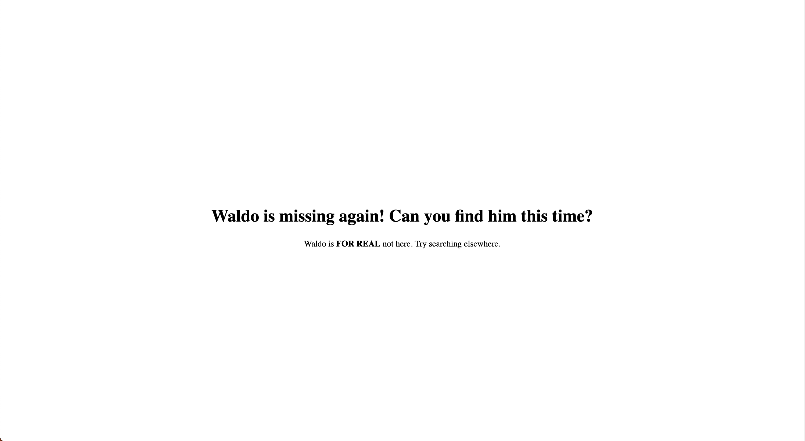

<font size="10">Where's Waldo? 2.0</font>

7<sup>th</sup> February 2024

​Prepared By: FROST8ytes

​Challenge Author(s): FROST8ytes

​Difficulty: <font color=green>Easy</font>

Flag: `Cyberhax{scr3w_y0u_W4ld0!}`

## Synopsis

This challenge involves visiting a homepage and inspecting the sources to find hidden secrets.

## Description

OMG Waldo is missing again! Find him and he will give you a new prize.

Flag example: `Cyberhax{3x4mp13_f14g_h3r3}`

Disclaimer: No bruteforce is needed.

## Skills Required

- Basic understanding of web
- Basic reconnaissance skills

## Skills Learned

- Inspecting files included in the page.

## Application Overview



### Visiting the Website

It shows a few lines of text instructing us to find Waldo. Nothing else seems to be displayed.

### Closer Inspection

By viewing the page source or inspecting the page, we see part 1 out of 3 of the flag embedded in the HTML code:

```html
<!DOCTYPE html>
<html lang="en">
<head>
    <meta charset="UTF-8">
    <meta name="viewport" content="width=device-width, initial-scale=1.0">
    <title>Where's Waldo? 2.0</title>
    <link rel="stylesheet" href="style.css">
    <script src="main.js" defer></script>
</head>
<body>
    <main>
        <h1>Waldo is missing again! Can you find him this time?</h1>
        <p>Waldo is <strong>FOR REAL</strong> not here. Try searching elsewhere.</p>
    </main>
    <!-- hmmm maybe we don't need to find Waldo to get the prize -->
    <!-- 1/3 Cyberhax{scr3w_y0 -->
</body>
</html>
```

This means that the other two parts of the flag are hidden somewhere else.

A closer read at the HTML code reveals that two files are included on the page.

```html
    ...
    <link rel="stylesheet" href="style.css">
    <script src="main.js" defer></script>
    ...
```

We can view the following files by `Secondary Click` > `Inspect` > `Resources` tab.

Part 2 out of 3 of the flag embedded in the comment of `style.css`:
```css
/* I hate the default CSS */
/* Anyway, here's a reset on the styling */
* {
    padding: 0;
    margin: 0;
    box-sizing: border-box;
}

/* ew the context is too close to the edge */
body {
    padding: 1.5rem;
}

/* okay now the lines are too close to each other */
p {
    padding: 1.5rem 0 1.5rem 0;
}

/* damn the page looks so empty */
/* time to center the content */
main {
    height: 100vh;
    display: flex;
    align-items: center;
    justify-content: center;
    flex-direction: column;
}

/* ahhh that looks better (not really lmao) */
/* 2/3 u_W4l */

strong {
    transition: font-size 0.3s ease;
}

/* ahhh that looks better */
```

Part 3 out of 3 of the flag is embedded in the comment of `main.js`:
```js
// the page looks so boring
// maybe I can add animations!

let strongElement = document.getElementsByTagName("strong")[0];

let initialFontSize = parseFloat(window.getComputedStyle(strongElement).fontSize);
let enlargedFontSize = initialFontSize * 1.5;

function enlargeText() {
    strongElement.style.fontSize = enlargedFontSize + 'px';
}

function resetText() {
    strongElement.style.fontSize = initialFontSize + 'px';
}

strongElement.addEventListener('mouseenter', enlargeText);
strongElement.addEventListener('mouseleave', resetText);

// the animation is not smooth
// perhaps I should've written it in the CSS file

// 3/3 d0!}
```