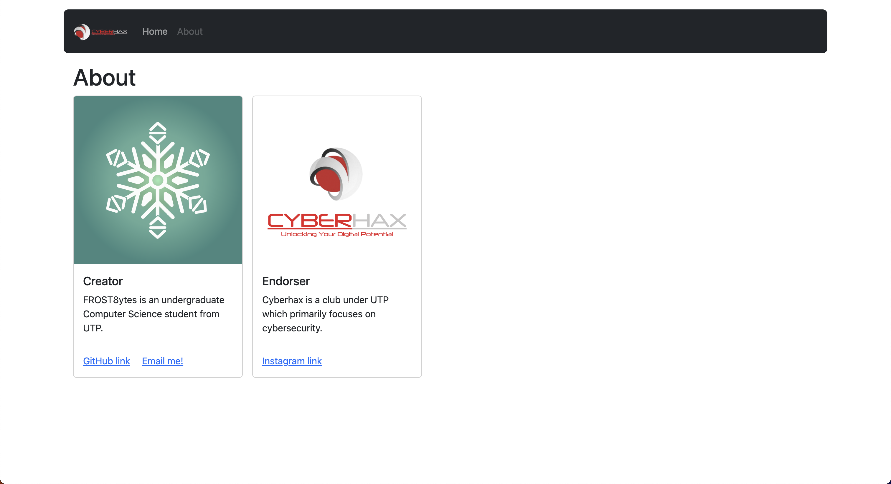

<font size="10">Your Vision is too Slow</font>

7<sup>th</sup> February 2024

​Prepared By: FROST8ytes

​Challenge Author(s): FROST8ytes

​Difficulty: <font color=green>Medium</font>

Flag: `Cyberhax{5p33d_0f_l1gh7_1337}`

## Synopsis

The challenge shows a quick redirection from `home` to `about` page.

## Description

Sometimes things appear faster than what meets the eye. Hmmm maybe there is a way to capture it just like a speed camera.

Flag example: `Cyberhax{3x4mp13_f14g_h3r3}`

Disclaimer: No bruteforce is needed.

## Skills Required

- Basic usage of CLI or Wireshark or any other packet capture programs

## Skills Learned

- Tracing packets being sent and retrieved.

## Application Overview



### Visiting the Website

When visiting the website, the URL automatically appends `about.html` at the end of it.

When clicking `Home` in the navigation bar of the page, we see a short glimpse of the page, then it redirects back to `about.html`.

### Capturing the Packet

To view the `Home` without redirection, we can use many tools, such as:

- Burp Suite
- Wireshark
- curl
- etc.

For the sake of this writeup, `curl` will be used.

By executing the command `curl http://<challenge URL>/`, it will output the HTML code for `Home` page, which reveals the flag:

```html
<!DOCTYPE html>
<html lang="en">
<head>
    <meta charset="UTF-8">
    <meta name="viewport" content="width=device-width, initial-scale=1.0">
    <title>That was fast!</title>
    <link rel="icon" type="image/x-icon" href="assets/favicon.ico">
    <link href="https://cdn.jsdelivr.net/npm/bootstrap@5.3.2/dist/css/bootstrap.min.css" rel="stylesheet" integrity="sha384-T3c6CoIi6uLrA9TneNEoa7RxnatzjcDSCmG1MXxSR1GAsXEV/Dwwykc2MPK8M2HN" crossorigin="anonymous">
</head>
<body>
    <div class="container container-dark">
        <nav class="navbar navbar-expand-lg navbar-dark bg-dark rounded-3 p-3 mt-3">
            <a class="navbar-brand" href="#">
                
            </a>
            <div class="collapse navbar-collapse" id="navbarNav">
                <ul class="navbar-nav">
                    <li class="nav-item active">
                        <a class="nav-link disabled" href="#">Home</a>
                    </li>
                    <li class="nav-item">
                        <a class="nav-link" href="about.html">About</a>
                    </li>
                </ul>
              </div>
        </nav>
        <main class="p-3">
            <h1>Wow you're so good! You must be a 1337 h4xx0r!</h1>
            <p><code>Cyberhax{5p33d_0f_l1gh7_1337}</code></p>
        </main>
    </div>

    <script src="https://cdn.jsdelivr.net/npm/bootstrap@5.3.2/dist/js/bootstrap.bundle.min.js" integrity="sha384-C6RzsynM9kWDrMNeT87bh95OGNyZPhcTNXj1NW7RuBCsyN/o0jlpcV8Qyq46cDfL" crossorigin="anonymous"></script>
    <script>
        setTimeout(() => window.location.href = "about.html", 5);
    </script>
</body>
</html>
```